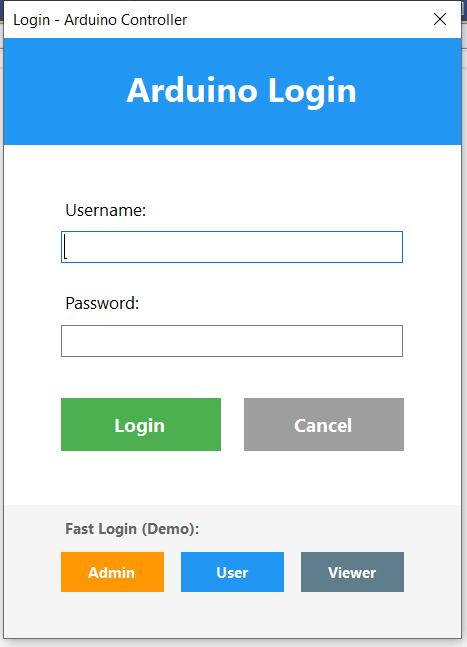
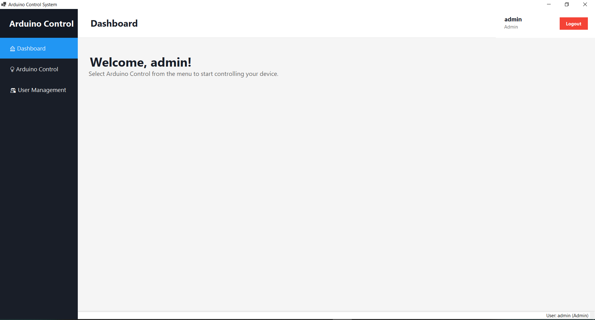
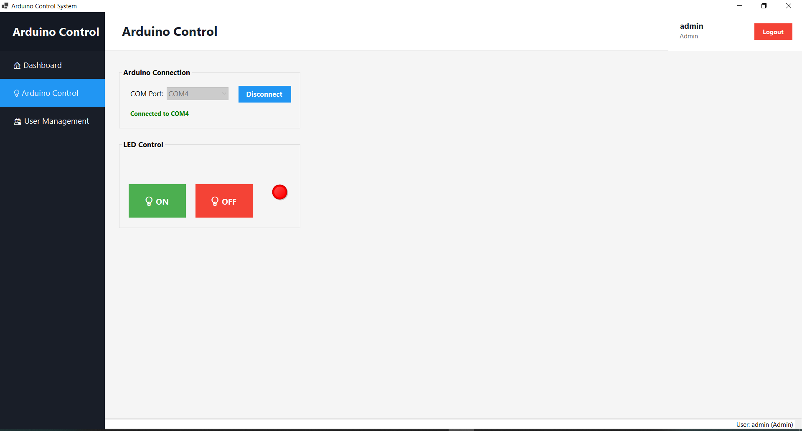
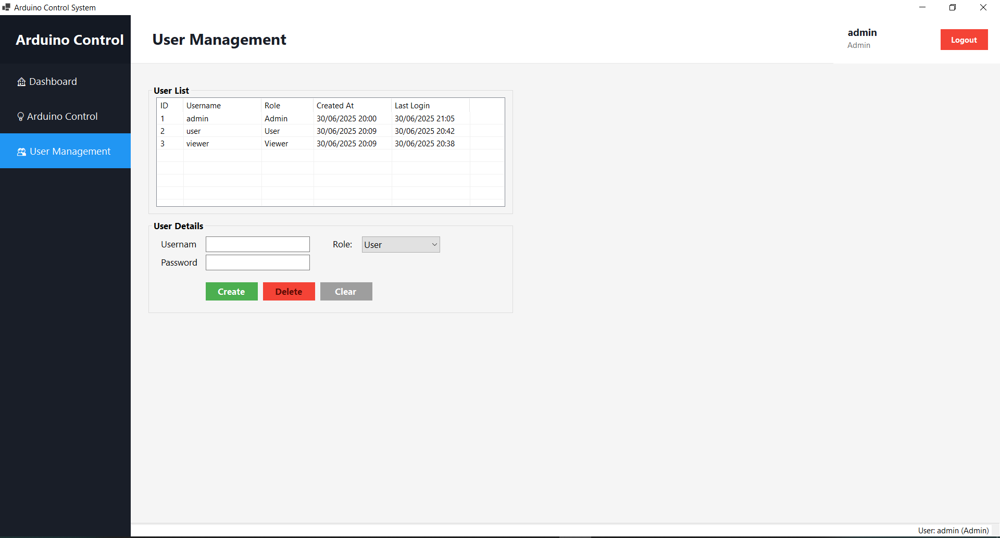

# Arduino Control System

ระบบควบคุม Arduino ผ่าน Serial Port พร้อมระบบ Login และการจัดการผู้ใช้

## ภาพหน้าจอ

### หน้า Login


### หน้าหลัก (Dashboard)


### หน้าควบคุม Arduino


### หน้าจัดการผู้ใช้


## คุณสมบัติหลัก

- 🔌 **ควบคุม Arduino** - เชื่อมต่อและควบคุม LED ผ่าน Serial Port
- 🔐 **ระบบ Login/Logout** - ระบบยืนยันตัวตนด้วย Username และ Password
- 👥 **ระบบสิทธิ์ผู้ใช้ 3 ระดับ**
  - **Admin** - จัดการผู้ใช้และควบคุม Arduino ได้
  - **User** - ควบคุม Arduino ได้
  - **Viewer** - ดูข้อมูลได้อย่างเดียว
- 📊 **User Management** - เพิ่ม/แก้ไข/ลบผู้ใช้ (Admin เท่านั้น)
- 🔄 **ตรวจสอบการเชื่อมต่อ** - ตรวจสอบสถานะ Arduino ทุก 5 วินาที
- 🖥️ **Modern UI** - หน้าจอแบบ Web-style พร้อม Sidebar และ Top Bar

## ข้อกำหนดระบบ

- Windows 10 หรือสูงกว่า
- .NET 8.0 Runtime หรือสูงกว่า
- Arduino board พร้อมสาย USB
- COM Port driver ที่ติดตั้งแล้ว

## การติดตั้ง

### 1. ติดตั้ง .NET 8.0
ดาวน์โหลดและติดตั้ง .NET 8.0 Runtime จาก:
https://dotnet.microsoft.com/download/dotnet/8.0

### 2. Clone หรือดาวน์โหลด Repository
```bash
git clone https://github.com/yourusername/Arduino.git
cd Arduino
```

### 3. Build โปรแกรม
```bash
dotnet build
```

### 4. รันโปรแกรม
```bash
dotnet run
```

หรือรันไฟล์ .exe จากโฟลเดอร์ `bin/Debug/net8.0-windows/`

## การใช้งาน

### ผู้ใช้เริ่มต้น
โปรแกรมมีผู้ใช้เริ่มต้น 3 คน:

| Username | Password  | Role   |
|----------|-----------|--------|
| admin    | admin123  | Admin  |
| user     | user123   | User   |
| viewer   | viewer123 | Viewer |

### ขั้นตอนการใช้งาน

1. **Login** - ใส่ Username และ Password หรือใช้ปุ่ม Fast Login
2. **เชื่อมต่อ Arduino**
   - เลือก COM Port จากรายการ
   - คลิก Connect
   - รอให้สถานะเปลี่ยนเป็น "Connected"
3. **ควบคุม LED**
   - คลิกปุ่ม ON เพื่อเปิด LED
   - คลิกปุ่ม OFF เพื่อปิด LED
4. **จัดการผู้ใช้** (Admin เท่านั้น)
   - คลิกเมนู User Management ใน Sidebar
   - เพิ่ม/แก้ไข/ลบผู้ใช้ผ่าน Interface แบบ embedded ในหน้าหลัก

### โค้ด Arduino ตัวอย่าง

```cpp
void setup() {
  Serial.begin(9600);
  pinMode(LED_BUILTIN, OUTPUT);
}

void loop() {
  if (Serial.available() > 0) {
    char command = Serial.read();
    
    if (command == '1') {
      digitalWrite(LED_BUILTIN, HIGH);
    } else if (command == '0') {
      digitalWrite(LED_BUILTIN, LOW);
    }
  }
}
```

## โครงสร้างโปรเจค

```
Arduino/
├── Forms/                    # Windows Forms
│   └── LoginForm.cs         # หน้า Login
├── Models/                   # Data Models
│   └── User.cs              # User model และ Roles
├── Services/                 # Business Logic
│   ├── AuthenticationService.cs  # ระบบ Login/Logout
│   └── DatabaseService.cs       # จัดการฐานข้อมูล SQLite
├── Form1.cs                 # หน้าหลัก (รวม User Management แบบ embedded)
├── Program.cs               # Entry point
├── Arduino.csproj           # Project file
└── appsettings.json         # Configuration

Database:
└── users.db                 # SQLite database (สร้างอัตโนมัติในโฟลเดอร์ executable)
```

## การ Build สำหรับ Production

### Build แบบ Self-Contained (ไม่ต้องติดตั้ง .NET Runtime)
```bash
dotnet publish -c Release -r win-x64 --self-contained true
```

### Build แบบ Framework-Dependent (ต้องติดตั้ง .NET Runtime)
```bash
dotnet publish -c Release
```

ไฟล์ที่ build เสร็จจะอยู่ในโฟลเดอร์ `bin/Release/net8.0-windows/publish/`

## ฐานข้อมูล

โปรแกรมใช้ SQLite Database ชื่อ `users.db` ซึ่งจะถูกสร้างอัตโนมัติเมื่อรันโปรแกรมครั้งแรก

**ตำแหน่งไฟล์ DB:**
- Development: `bin/Debug/net8.0-windows/users.db`
- Release: `bin/Release/net8.0-windows/users.db` 
- Published: อยู่ในโฟลเดอร์เดียวกับไฟล์ .exe

**ข้อมูลผู้ใช้เริ่มต้น:**
ระบบจะสร้างผู้ใช้เริ่มต้น 3 คนอัตโนมัติ (admin, user, viewer) หากยังไม่มีในฐานข้อมูล

## Libraries ที่ใช้

- **System.IO.Ports** - สำหรับ Serial Communication
- **Microsoft.Data.Sqlite** - สำหรับฐานข้อมูล SQLite
- **BCrypt.Net-Next** - สำหรับเข้ารหัส Password
- **Microsoft.Extensions.Configuration.Json** - สำหรับอ่าน Configuration

## License

This project is licensed under the MIT License - see the LICENSE file for details.
